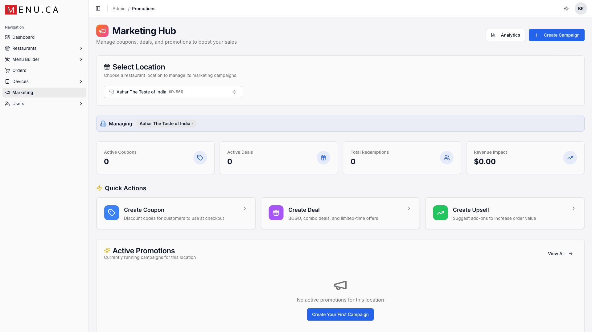
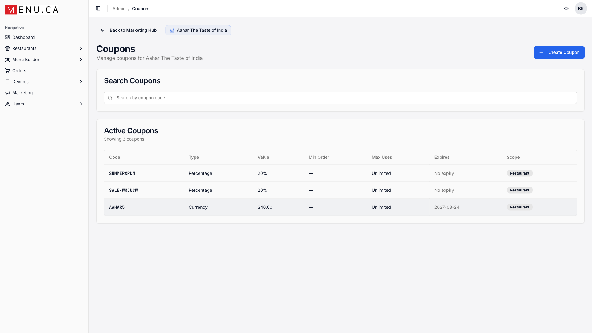
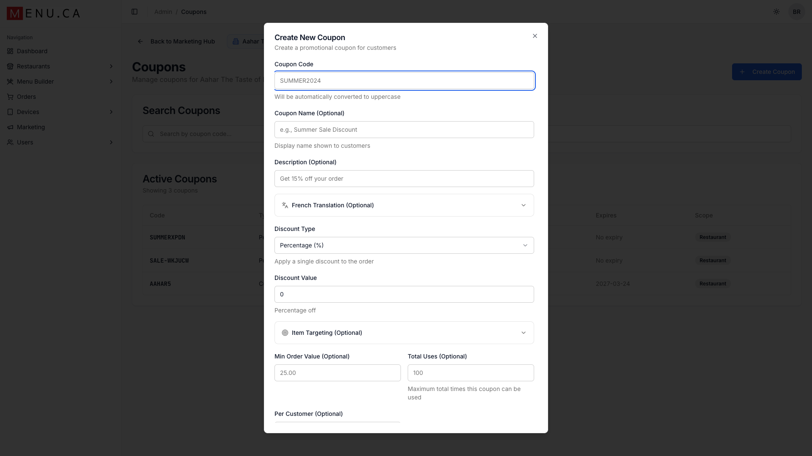
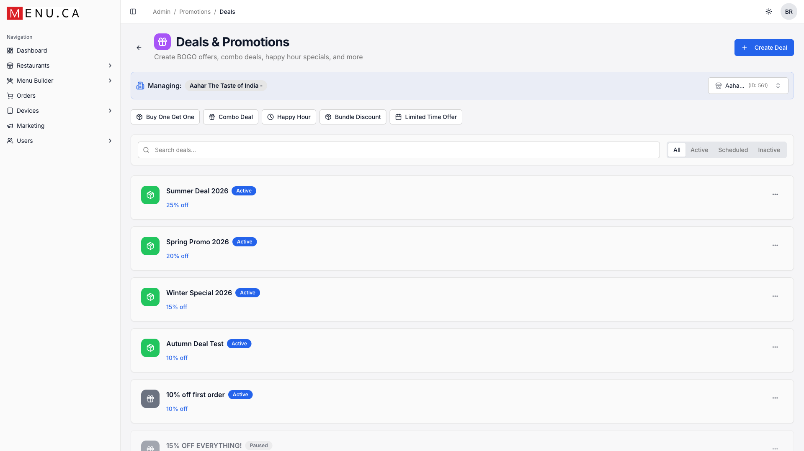
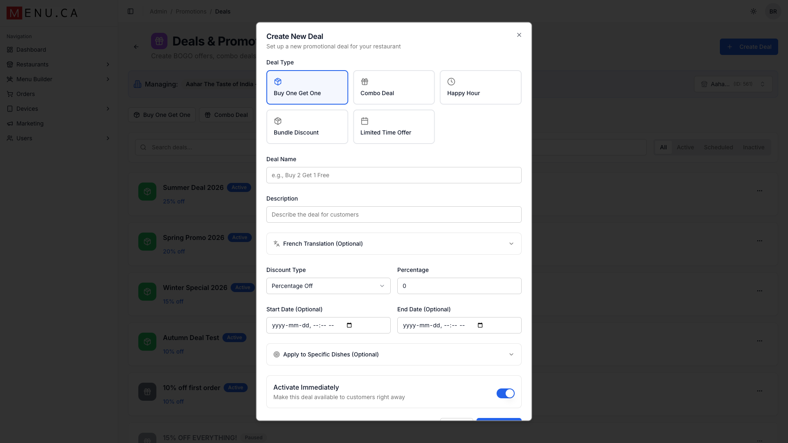
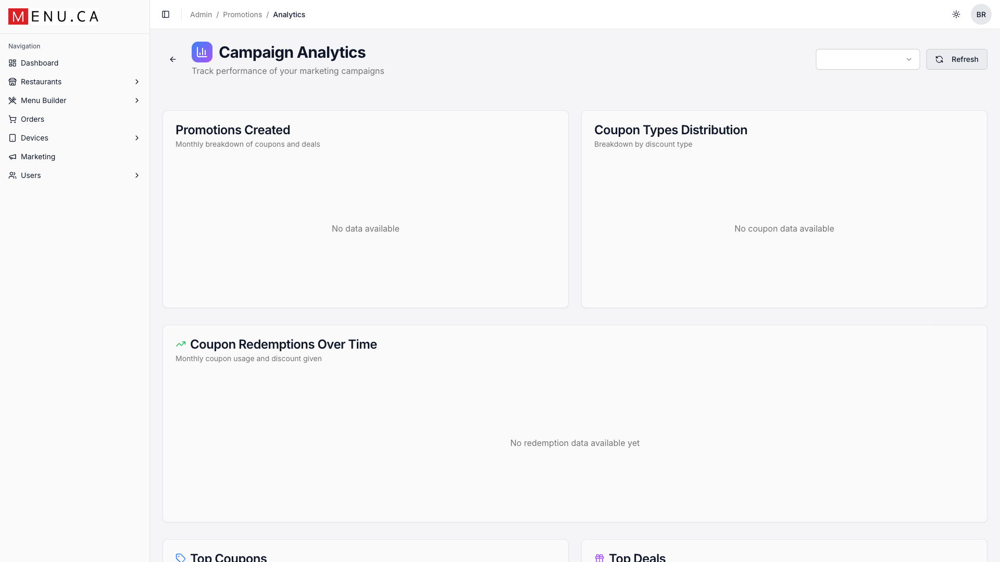

# Marketing Hub Guide

**Boost your sales with coupons, deals, and promotional campaigns**

---

*The Marketing Hub - Your promotional control center*

---

## Marketing Hub Overview

The Marketing Hub is your one-stop shop for running promotions that drive sales. Create discount codes, BOGO deals, happy hour specials, and more - all with built-in analytics to track what's working.

### Key Features

| Feature | What It Does |
|---------|--------------|
| **Coupons** | Discount codes customers enter at checkout |
| **Deals** | Automatic promotions (BOGO, happy hour, bundles) |
| **Upsells** | Suggest add-ons to increase order value |
| **Analytics** | Track performance and revenue impact |

---

## Creating Coupons

Coupons are discount codes that customers manually enter during checkout. They're perfect for email campaigns, social media promotions, or loyalty rewards.

*The Coupons management page*

### Creating a New Coupon

1. Click **+ Create Coupon**
2. Enter a memorable coupon code (e.g., 'SUMMER2024')
3. Choose discount type: Percentage (%) or Fixed Amount ($)
4. Set the discount value
5. Optionally add usage limits and expiry dates
6. Click **Create**

*The Create Coupon dialog*

### Coupon Options Explained

| Field | Description |
|-------|-------------|
| **Coupon Code** | The code customers enter (auto-converts to uppercase) |
| **Coupon Name** | Display name shown to customers (optional) |
| **Description** | Internal notes about this coupon |
| **French Translation** | For bilingual support |
| **Discount Type** | Percentage (%), Fixed Amount ($), or Tiered |
| **Min Order Value** | Minimum order total to use coupon |
| **Total Uses** | Maximum redemptions allowed |
| **Per Customer** | Limit uses per individual customer |
| **Item Targeting** | Apply to specific dishes or categories |

---

## Creating Deals

Deals are automatic promotions that apply without needing a code. Use them for happy hours, combo specials, or limited-time offers that create urgency.

*The Deals page showing active promotions*

### Deal Types

| Deal Type | Best For | Example |
|-----------|----------|---------|
| **Buy One Get One** | Moving inventory | Buy 1 pizza, get 1 free |
| **Combo Deal** | Increasing order size | Burger + Fries + Drink for $12 |
| **Happy Hour** | Slow period traffic | 20% off drinks 3-5pm |
| **Bundle Discount** | Family orders | Family Pack: 2 large pizzas + sides |
| **Limited Time Offer** | Creating urgency | This weekend only: 30% off |

*Creating a new deal*

### Creating a New Deal

1. Click **+ Create Deal**
2. Select deal type (BOGO, Combo, Happy Hour, etc.)
3. Enter deal name and description
4. Set discount type and value
5. Optionally set date restrictions and item targeting
6. Toggle "Activate Immediately" or schedule for later
7. Click **Create Deal**

---

## Analytics & Tracking

The Analytics dashboard shows you exactly how your promotions are performing. Track redemptions, revenue impact, and identify your most effective campaigns.

*Campaign Analytics dashboard*

### Key Metrics to Watch

- **Total Redemptions:** How many times promotions were used
- **Revenue Impact:** Additional revenue generated by promotions
- **Conversion Rate:** Percentage of views that result in redemptions
- **Average Order Value:** Compare promoted vs. regular orders

> **Tip:** Run A/B tests! Create two similar promotions with slight variations (e.g., 15% off vs. $5 off) to see which performs better with your customers.

---

## Marketing Best Practices

### Coupon Strategy

- **Make codes memorable:** PIZZA20 is easier than XK7DJ2M
- **Set expiry dates:** Creates urgency and prevents indefinite discounting
- **Limit usage:** 'First 100 customers' drives faster action
- **Track sources:** Use different codes for email vs social media

### Deal Timing

- **Target slow periods:** Happy hour deals for typically quiet times
- **Seasonal promotions:** Summer BBQ specials, holiday deals
- **Event tie-ins:** Game day combos, Valentine's dinner deals
- **Test and learn:** Start with smaller discounts and adjust

---

## Quick Reference

### Getting Started Checklist

- [ ] Select your restaurant location from the dropdown
- [ ] Review your current active promotions
- [ ] Create your first coupon for email subscribers
- [ ] Set up a happy hour deal for slow periods
- [ ] Check analytics weekly to track performance

### Common Actions

| Action | Where to Find It |
|--------|------------------|
| Create a coupon | Marketing Hub → Create Coupon card |
| Create a deal | Marketing Hub → Create Deal card |
| View analytics | Marketing Hub → Analytics button (top right) |
| Edit existing promotion | Click on the promotion in the list |
| Pause a promotion | Click ⋮ menu → Pause |

---

*Need help? Contact support at support@menu.ca*
