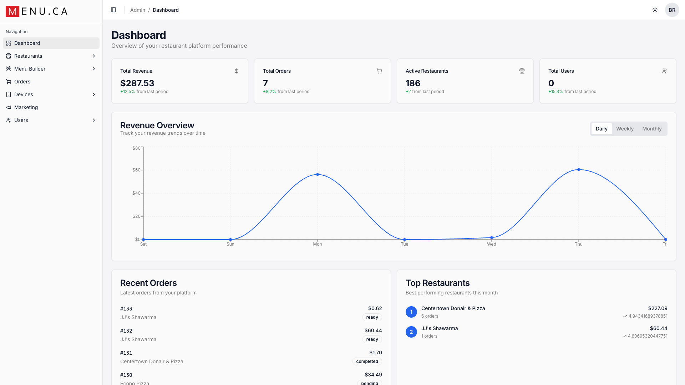
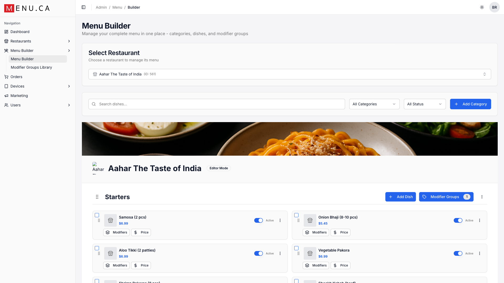
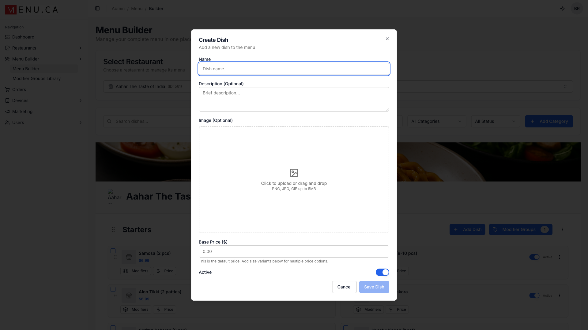
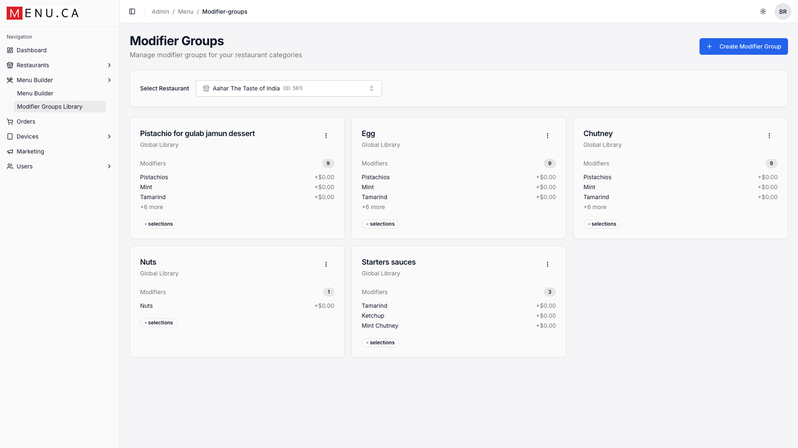
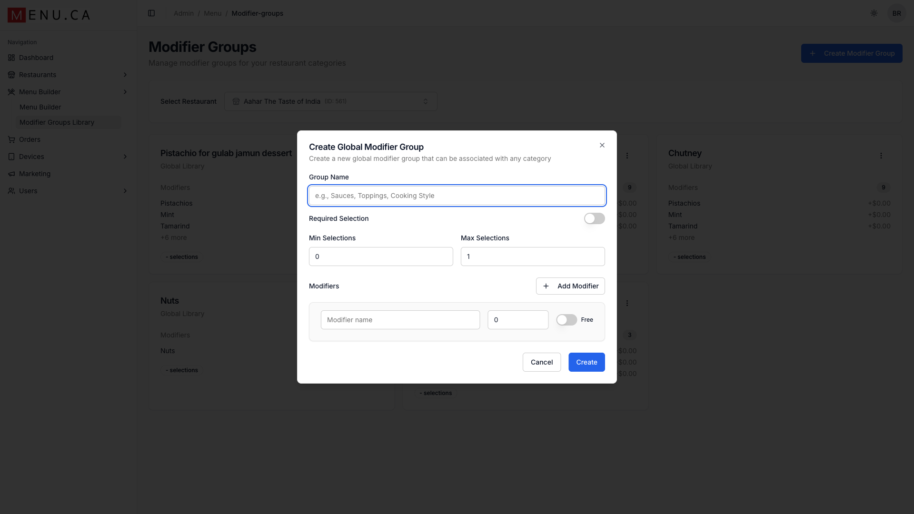

# Menu Builder Guide

**Your complete guide to creating and managing your restaurant menu on Menu.ca**

---

*The Menu.ca Dashboard - Your restaurant management hub*

---

## Getting Started

The Menu Builder is your central hub for managing everything your customers see when ordering. From this single interface, you can add dishes, set prices, organize categories, and configure modifiers.

### Accessing Menu Builder

1. Log in to your Menu.ca admin dashboard
2. Click **Menu Builder** in the left navigation
3. Select your restaurant from the dropdown (if you manage multiple locations)

*Menu Builder showing categories and dishes*

---

## Managing Categories

Categories help organize your menu into logical sections that customers can easily browse. Common categories include Appetizers, Main Courses, Desserts, Beverages, and Specials.

### Creating a New Category

1. Click the **+ Add Category** button
2. Enter a category name (e.g., 'Lunch Specials')
3. Optionally add a description
4. Set the display order (lower numbers appear first)
5. Click **Save**

> **Tip:** Use clear, descriptive category names. 'Lunch Specials (11am-3pm)' is more helpful than just 'Specials'.

### Category Features

| Feature | Description |
|---------|-------------|
| **Drag & Drop** | Reorder categories by dragging them |
| **Active Toggle** | Show/hide entire categories |
| **Add Dish** | Add dishes directly to a category |
| **Modifier Groups** | Attach modifier groups to all dishes in a category |

---

## Adding Dishes

Each dish on your menu needs essential information: a name, price, and category. You can also add descriptions, images, and modifiers to give customers all the details they need.

*The Add Dish dialog with all available options*

### Required Fields

| Field | Description | Example |
|-------|-------------|---------|
| **Dish Name** | What customers see on the menu | Classic Pepperoni Pizza |
| **Price** | Base price before modifiers | $14.99 |
| **Category** | Which menu section it appears in | Pizza |

### Optional Fields

| Field | Description |
|-------|-------------|
| **Description** | Appetizing details about the dish |
| **French Translation** | Name/description in French for bilingual menus |
| **Image** | Photo of the dish (recommended: 800x600px) |
| **Active Toggle** | Show/hide dish on the menu |
| **Modifiers** | Attach modifier groups for customization |

### Dish Card Controls

Each dish card in the Menu Builder shows:

- **Active toggle** - Blue = visible to customers
- **Modifiers button** - Shows count of attached modifier groups
- **Price button** - Quick edit for pricing
- **⋮ Menu** - Edit, duplicate, or delete

---

## Modifier Groups

Modifiers let customers customize their orders - think pizza toppings, drink sizes, or cooking preferences. The Modifier Groups Library stores reusable modifier sets you can apply to multiple dishes.

*Your library of reusable modifier groups*

### Creating a Modifier Group

1. Navigate to **Menu Builder → Modifier Groups Library**
2. Click **+ Create Modifier Group**
3. Enter a group name (e.g., 'Pizza Toppings')
4. Set selection rules (min/max selections, required or optional)
5. Add individual modifiers with their prices
6. Click **Create**

*Creating a new modifier group*

### Modifier Group Settings

| Setting | Description | Example |
|---------|-------------|---------|
| **Group Name** | What customers see | "Choose Your Toppings" |
| **Required Selection** | Must customer choose? | Toggle on for required |
| **Min Selections** | Minimum choices | 0 for optional, 1+ for required |
| **Max Selections** | Maximum choices | 3 for "pick up to 3" |

### Modifier Options

For each modifier in a group:

| Field | Description |
|-------|-------------|
| **Name** | The option name (e.g., "Extra Cheese") |
| **Price** | Additional cost ($0.00 for free options) |
| **Free Toggle** | Mark as included at no extra charge |

---

## Best Practices

### Menu Organization Tips

- **Keep it simple:** 5-7 categories maximum works best for most restaurants
- **Lead with your best:** Put popular items at the top of each category
- **Use appetizing descriptions:** 'Hand-breaded crispy chicken tenders' sells better than 'Chicken strips'
- **Price strategically:** Avoid ending prices in .99 for upscale items

### Modifier Best Practices

- **Group logically:** Keep related modifiers together (all toppings in one group)
- **Set sensible limits:** If pizza comes with 3 toppings, set max selections to 3 for free toppings
- **Price add-ons fairly:** Customers expect premium toppings to cost more
- **Use 'Free' toggle:** Mark included items as free so customers know the value

> **Tip:** Review your menu on a mobile device! Most customers order from their phones, so make sure descriptions aren't too long and prices are easy to read.

---

## Quick Reference

### Navigation

| Location | How to Get There |
|----------|------------------|
| Menu Builder | Sidebar → Menu Builder → Menu Builder |
| Modifier Groups | Sidebar → Menu Builder → Modifier Groups Library |
| Edit a Dish | Click dish card → ⋮ menu → Edit |
| Add Category | Menu Builder → + Add Category button |

### Common Tasks

| Task | Steps |
|------|-------|
| **Add a dish** | Select category → Click "Add Dish" → Fill form → Save |
| **Edit price** | Click "Price" button on dish card → Enter new price → Save |
| **Hide a dish** | Click the blue toggle on dish card (turns gray when hidden) |
| **Attach modifiers** | Click "Modifiers" on dish card → Select groups → Save |
| **Reorder dishes** | Drag dishes by the ⋮⋮ handle on the left |

### Keyboard Shortcuts

| Shortcut | Action |
|----------|--------|
| `Esc` | Close modal/dialog |
| `Enter` | Save/confirm (when in form) |
| `Tab` | Move to next field |

---

## Troubleshooting

### Dish Not Showing on Menu?

1. Check the **Active toggle** is blue (on)
2. Verify the **Category** is also active
3. Confirm you selected the right **Restaurant** in the dropdown

### Modifiers Not Appearing?

1. Ensure the modifier group is **attached to the dish**
2. Check the modifier group has at least one modifier added
3. Verify prices are set (even $0.00 for free options)

### Changes Not Saving?

1. Look for validation errors (red text under fields)
2. Ensure required fields are filled
3. Try refreshing the page and re-entering

---

*Need help? Contact support at support@menu.ca*
